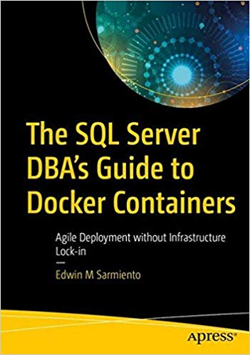

# The SQL Server DBA’s Guide to Docker Containers
### Agile Deployment without Infrastructure Lock-in 1st ed. Edition
https://tinyurl.com/SQLonDockerBook

Get introduced to the world of Docker containers from a SQL Server DBA’s perspective. This book explains container technology and how it can improve the deployment of your SQL Server databases without infrastructure lock-in. You will be equipped with the right technical skills to guide stakeholders in your business as they adopt and adapt to new technologies to improve time-to-market and competitiveness. You will learn how to build a lab environment at home on which to build skills that transfer directly into your day job. 

This book teaches you how to install and configure Docker on both Windows Server and Linux operating systems. You will learn the most common Docker commands that you need to know as a DBA to deploy and manage SQL Server on containers. Support for SQL Server on Linux is new, and this book has your back with guidance on creating Docker images specifically for deployment to a Linux platform. Included is coverage of key Linux commands needed to manage SQL Server on that operating system. By the end of the book you will have learned how to create your own custom SQL Server container images with configuration settings that are specific to your organization, that are capable of being deployed to both Windows Server and Linux.

You will:

- Create Docker containers for agile deployment of SQL Server
- Run multiple SQL Server instances on a single Linux machine
- Deploy custom images specific to your organization’s needs
- Know the benefits and architecture of container technology
- Install and configure Docker on Windows Server and Linux 
- Manage and persist SQL Server data in Docker containers

### Who This Book Is For

For the intermediate to senior SQL Server DBA who is familiar with SQL Server on Windows and wants to build their existing skills to deploy and manage SQL Server on Linux and through Docker containers. Readers should have a grasp of relational database concepts and be comfortable with the Transact-SQL language.

## How This Book Is Structured

This book consists of 11 chapters with an Appendix and is structured in the following way:

- ***Chapter 1*** introduces you to container technologies, a bit of a history of how it started and how Microsoft adopted it for the Windows Server operating system as well as SQL Server on Linux.
- ***Chapter 2*** walks you through how to configure a Windows Server operating system as a container host, allowing you to leverage your existing knowledge of Windows.
- ***Chapter 3*** covers a bit of what you need to know to get started with the Linux operating system in preparation for configuring it to run as a container host.
- ***Chapter 4*** covers the Docker ecosystem to better understand how container technologies work.
- ***Chapter 5*** introduces you to Docker images and containers but with a focus on using them with SQL Server.
- ***Chapter 6*** is where managing and administering containers come in, introducing the most common operational tasks that you need to perform when working with containers.
- ***Chapter 7*** introduces the concept of persisting data with containers since SQL Server is designed to store and persist data.
- ***Chapter 8*** covers a bit of working with SQL Server on Linux, the installation and management experience to get you started with administering SQL Server on Linux and, eventually, building custom SQL Server on Linux container images.
- ***Chapter 9*** walks you through building a custom SQL Server on Windows container image that you can use for standardized deployments.
- ***Chapter 10*** walks you through building a custom SQL Server on Linux container image. 
- ***Chapter 11*** covers a bit of Docker networking so you can better configure SQL Server on containers for interaction with other applications.
- ***Appendix A: Building a Personal Lab Environment*** walks you through building a personal lab environment that mimics a real-world, on-premises environment to run Docker containers.

## Code Samples

The code samples for this book are available through scripts in folders arranged on a per-chapter basis. 